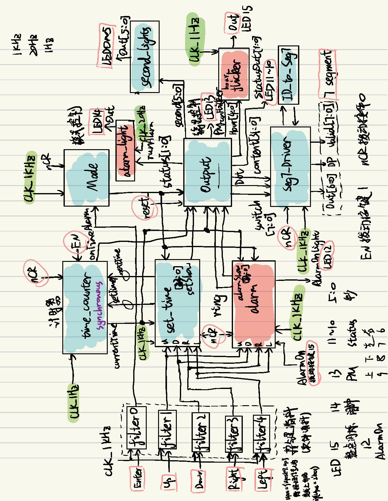

# Verilog Digital Clock

## Introduction

**Vivado Version**: 2023

**development board**: Nexys4DDR

**Features**:
1. **Basic Digital Clock**: Designed to display hours, minutes, and seconds.
2. **12/24 Hour Format**: Supports switching between 12-hour and 24-hour formats.
3. **Alarm Setting**: Supports setting alarms.
4. **Hourly Chime**: At the hour, an LED light flickers to indicate the time (flashes equal to the hour).

## Detail

**Design**

**Module Design**:

1. **Frequency Divider (frequency_div):** Adjustable module for outputting different frequencies.
2. **Debouncing Module (filter):** Uses software debouncing to filter out noise from button inputs.
3. **Timer (time_counter):** Controls hours, minutes, and seconds with 24 bits of storage for time and carry flag variables for each digit.
4. **Time Setting (set_time):** Allows users to set time intuitively with up, down, left, and right keys, paying attention to the upper and lower limits of each digit.
5. **Mode Control (Mode):** Offers four modes (24-hour display, 12-hour display, time setting, alarm setting) and utilizes a three-stage finite state machine for switching between modes.
6. **Output Control (Output):** Manages all output adjustments and mode-dependent conversions for display modules and LEDs.
7. **Seven-Segment Display Driver (Seg7_Driver):** Uses dynamic scanning to display content on multiple segments simultaneously and efficiently.
8. **Seven-Segment Display Decoder (ID_to_Seg7):** Converts 4-bit codes to 7-bit characters to display numbers and some characters on the seven-segment display.
9. **Second LED Control (second_lights):** Simple module for displaying seconds using LEDs.
10. **Alarm Module (alarm):** Allows setting and storing alarm times, triggering an LED indicator when the alarm time is reached.
11. **Hourly Flicker Module (flicker):** Makes corresponding LED flicker at the top of each hour according to the current hour number.
12. **Alarm Light Flicker Module (alarm_light):** Causes an LED to flicker, indicating the set alarm time has been reached.
